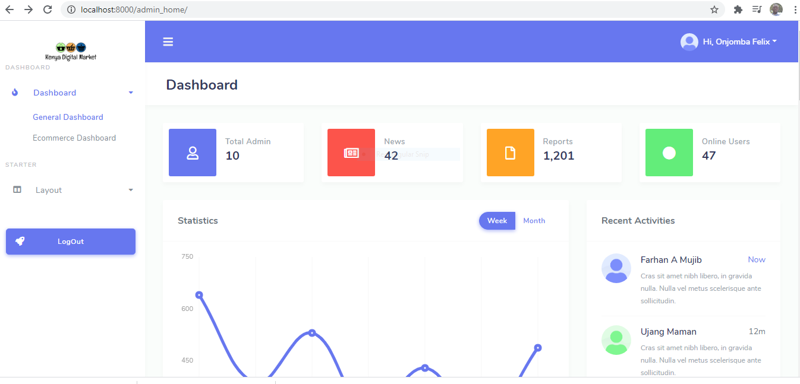
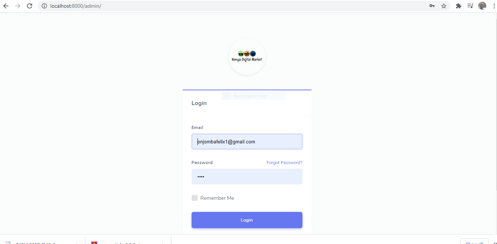

# Python-Django-Ecommerce-Amazon-Clone

Developing amazon with django from scratch for kenya Digital market

Creating a beautiful logo for your site i usually use this free logo design tool https://www.freelogodesign.org. Felix recomends you to use this and also save as .png to hid the background,,,,,part of graphics in fixing logos.

Download the DBeaver from https://dbeaver.io/download/ and create the ER

## Er Diagram of Project

## Added BASE TEMPLATE Page

## Added Admin Signin Page

